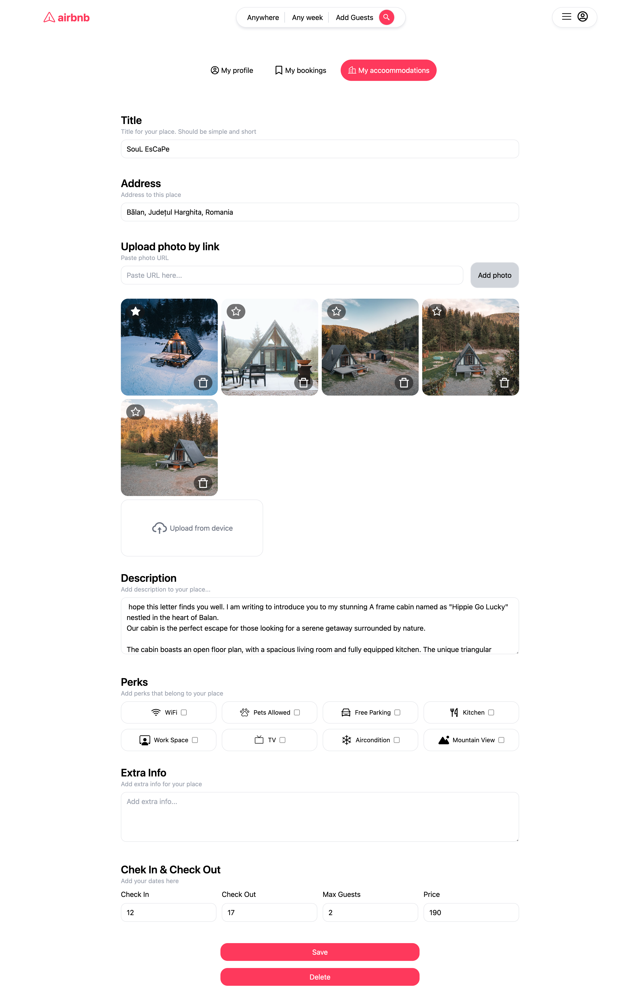
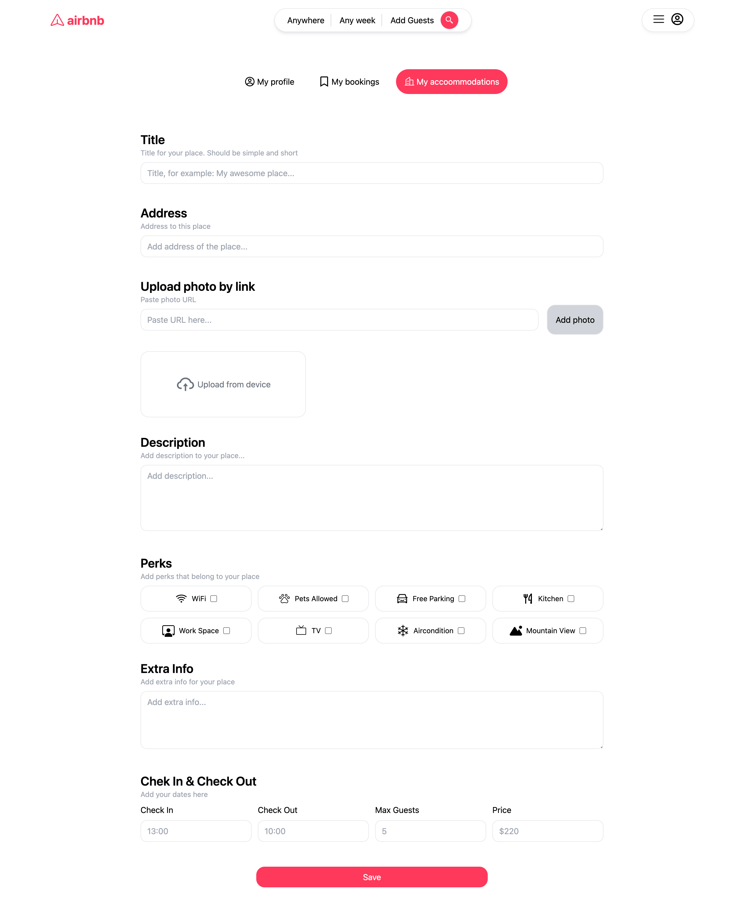
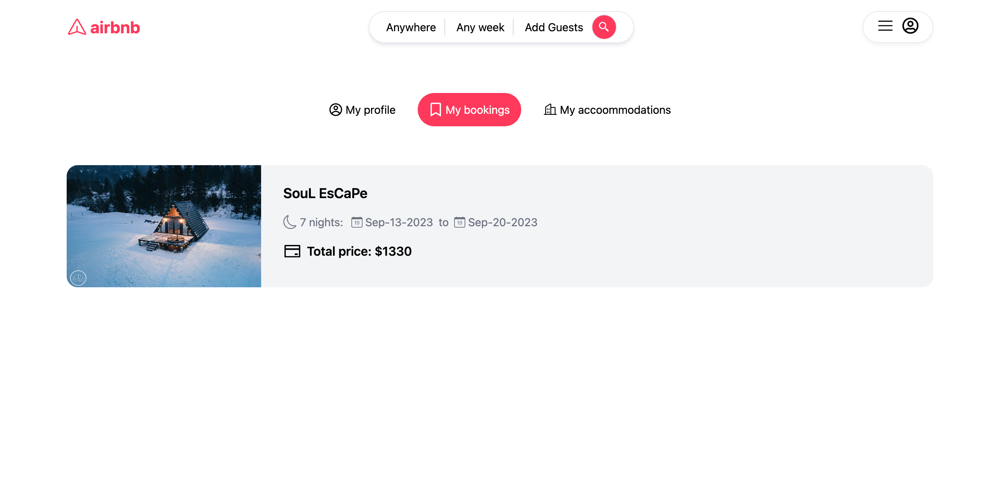

# Airbnb clone - Documentation
Welcome to Airbnb clone documentation. This document provides an overview of the app's functionality and technology stack.

## Live Demo - [Airbnb-Clone](https://cheery-gumdrop-619967.netlify.app/)

## Introduction

Welcome to the Airbnb Clone App documentation. This app is built using the MERN stack (MongoDB, Express, React, Node.js) and provides a platform for users to list their properties for rent, book properties, and manage their listings and bookings.

## Key Frames

- User Authentication: Users can sign up and log in securely to access the app's features.
- Property Listing: Users can add, edit, and delete their property listings.
- Booking System: Users can search for available properties and make bookings.
- Booking History: Users can view their booking history.

## Features

User authentication using JWT for secure access.
Full CRUD operations for property listings.
Booking system with date validation and conflict resolution.
Responsive design for both desktop and mobile devices.

## Installation

`Clone repo`

- Server Dev Mode `cd server` `npm i` `npm run start-dev`
- Client `cd client` `npm i` `npm run dev`

## Technology Stack

- MongoDB: Database for storing property and user data.
- Express.js: Web application framework for building the server.
- React.js: JavaScript library for building the user interface.
- Node.js: Runtime environment for the server.
- JWT (JSON Web Tokens): Used for user authentication.
- Tailwind CSS: Utility-first CSS framework.
- React-router-dom: Routing library for React applications.
- React-icons: Icon library for React components.
- Date-fns: Date utility library for JavaScript.
- Multer: Middleware for handling file uploads.
- Bcrypt: Library for hashing passwords.
- Cookie-parser: Middleware for parsing cookies in Express.
- Dotenv: Library for loading environment variables.

## Future Enhancements
The Airbnb Clone App can be further enhanced with the following features:

User reviews and ratings for properties.
Messaging system between property owners and renters.
Integration with payment gateways for handling transactions.
User profiles with additional information.
Advanced search and filtering options.

## Screenshots 

